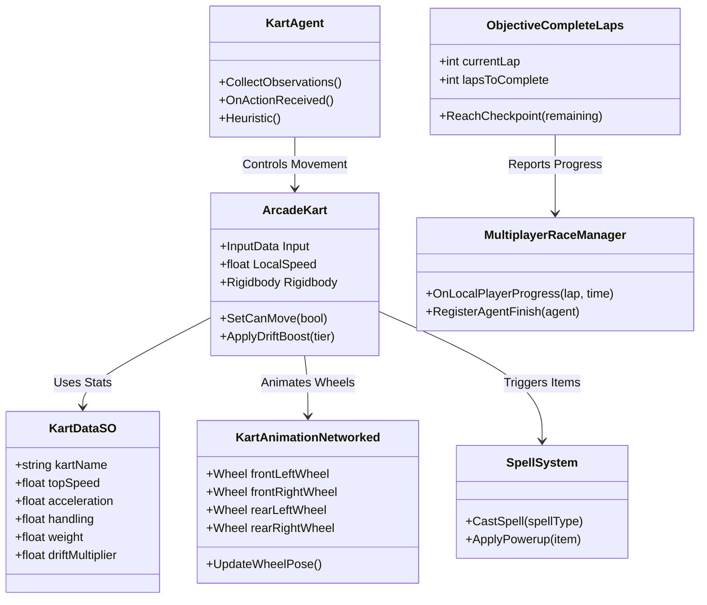
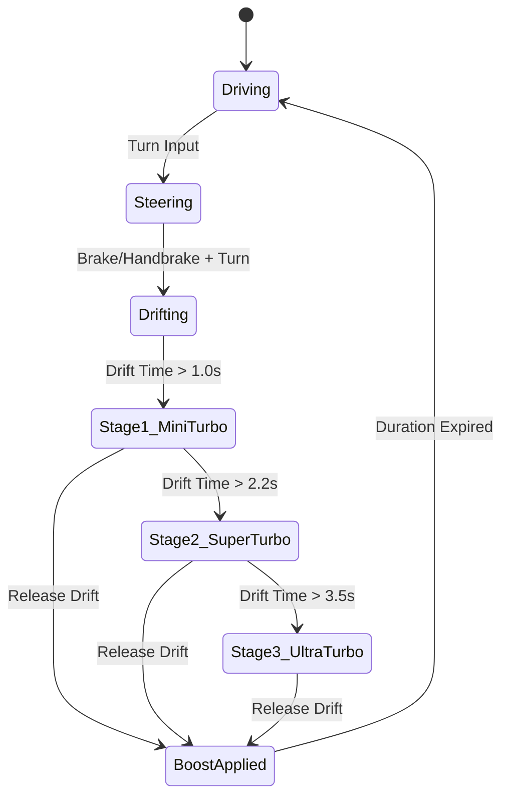

# Krash Kart — Master Game Development Blueprint & Production Roadmap

## 1. Executive Summary & Technical Vision

Krash Kart is an action arcade kart racing game built in Unity 2022.3. It combines real-time peer-to-peer multiplayer via Unity Netcode for GameObjects (NGO) and Unity Relay with autonomous AI opponents trained using Unity ML-Agents.

This blueprint serves as the living production master plan for transitioning from prototype into full game production.

---

## 2. System Architecture & Class Hierarchy



---

## 3. Production Roadmap by Phase

### Phase 1: Advanced Vehicle Physics, Drift System & Garage Architecture



#### Feature 1.1: 3-Tier Drift Boost Mechanic
* **Description**: Sustained drifting accumulates drift sparks (Stage 1: Blue / Mini Turbo, Stage 2: Orange / Super Turbo, Stage 3: Purple / Ultra Turbo). Releasing drift triggers a forward velocity boost proportional to the accumulated tier.
* **Technical Design**:
  ```csharp
  public enum DriftBoostTier { None, MiniTurbo, SuperTurbo, UltraTurbo }

  public class KartDriftHandler
  {
      private float driftTimer;
      public DriftBoostTier CurrentTier { get; private set; }

      public void UpdateDrift(bool isDrifting, float steeringAngle)
      {
          if (!isDrifting || Mathf.Abs(steeringAngle) < 0.3f)
          {
              if (CurrentTier != DriftBoostTier.None) TriggerBoost(CurrentTier);
              driftTimer = 0f;
              CurrentTier = DriftBoostTier.None;
              return;
          }

          driftTimer += Time.deltaTime;
          if (driftTimer >= 3.5f) CurrentTier = DriftBoostTier.UltraTurbo;
          else if (driftTimer >= 2.2f) CurrentTier = DriftBoostTier.SuperTurbo;
          else if (driftTimer >= 1.0f) CurrentTier = DriftBoostTier.MiniTurbo;
      }
  }
  ```
* **Potential Issues**: Excessive drift angle causes unnatural vehicle spinouts.
* **Fix & Mitigation**: Apply counter-steering dampening torque and clamp maximum slip angle to 45 degrees.
* **Why Not Alternatives**: Button-toggle auto-drift was rejected because analog steering threshold drift provides superior player skill expression.

#### Feature 1.2: Slipstream Drafting System
* **Description**: Driving directly behind an opponent kart for 2 seconds builds a drafting wind tunnel effect, granting a temporary +15% top speed boost.
* **Technical Design**: Forward sphere-cast from kart. If opponent hit for `t > 2.0s`, apply slipstream multiplier to `ArcadeKart.topSpeed`.
* **Potential Issues**: Drafting triggering through solid walls or track dividers.
* **Fix & Mitigation**: Add line-of-sight raycast layer mask validation (`LayerMask.GetMask("Track", "Walls")`).

#### Feature 1.3: ScriptableObject Garage & Vehicle Stats Schema
* **Description**: Modular garage framework where karts reference `KartDataSO` data assets for stats (Top Speed, Acceleration, Handling, Weight, Drift Multiplier).
* **Technical Design**: `KartDataSO` scriptable objects assigned per vehicle prefab in Inspector.

---

### Phase 2: Production Netcode, Prediction & Room Customization

#### Feature 2.1: Client-Side Prediction & Server Reconciliation
* **Description**: Local player moves immediately on input without waiting for server round-trip, interpolating non-owner karts.
* **Technical Design**: Buffer input history frames with sequence IDs in `OwnerAuthoritativeKart.cs`.

#### Feature 2.2: Advanced Lobby Room Settings UI
* **Description**: Host can customize race settings: Lap count (3, 5, 10), track selection, item toggle options, and AI bot count.
* **Technical Design**: Synchronize custom room options using Netcode `NetworkVariable<RoomSettingsStruct>`.

---

### Phase 3: AI & ML-Agent Neural Pipeline Expansion

#### Feature 3.1: Expanded Vector Sensor Observation Space
* **Description**: Upgrade `KartAgent.cs` observations to support obstacle detection, track curvature, and opponent awareness.
* **Technical Design**:
  * 3D Wall/Obstacle Raycasts: 7 forward raycasts (angles -45 to +45 degrees).
  * Track Curvature: Normalized dot product between kart forward vector and upcoming spline tangent.
  * Opponent Awareness: Relative positions and velocities of top 3 nearest karts.

#### Feature 3.2: Multi-Tier AI Difficulty Models (`Easy.onnx`, `Medium.onnx`, `Pro.onnx`)
* **Description**: Train three distinct neural network policy weights for variable AI difficulty settings.
* **Technical Design**: Adjust decision request interval (e.g. 5 steps for Pro, 10 steps for Medium, 15 steps for Easy) and speed caps.

---

### Phase 4: Track Infrastructure & Item Combat Arsenal

#### Feature 4.1: Track Infrastructure & Environmental Hazards
* **Description**: Circuit tracks with spline-based AI pathing, dynamic speed boost pads, ramp jumps, and environmental hazards (falling boulders, oil slicks).

#### Feature 4.2: Power-Up Item Arsenal
| Item | Type | Target Mechanism | Effect |
| :--- | :--- | :--- | :--- |
| **Forward Missile** | Offensive | Direct Raycast / Forward Vector | Explodes on contact, flips target kart |
| **Homing Missile** | Offensive | Lock-on to 1st Place Kart | Tracks along spline path to hit race leader |
| **Proximity Mine** | Defensive / Trap | Static Placement | Explodes when touched by enemy kart |
| **Energy Shield** | Defensive | Self | Absorbs 1 incoming item hit |
| **Nitro Boost** | Utility | Self | Grants instant 3-second velocity impulse |
| **EMP Shockwave** | Area Effect | Radius around Kart | Slows all karts within 15m radius |

---

### Phase 5: UI/UX, Dynamic Audio & Final Optimization

#### Feature 5.1: Modern Custom Race HUD
* **Description**: Complete HUD redesign featuring an analog/digital speedometer, circular lap ring, dynamic position leaderboard, spell item box, and mini-map overhead display.

#### Feature 5.2: Dynamic Engine RPM Audio Engine
* **Description**: Audio pitch modulation linked to `ArcadeKart.LocalSpeed / TopSpeed`, drift tire screeching, collision impact sounds, and dynamic music layers.

---

## 4. Live Feature Backlog & Community Ideas

*(This section will be updated continuously as new feature ideas, mechanics, and improvements are introduced during development.)*

### Backlog Item Template
* **Idea Name**: *(Feature Title)*
* **Description**: *(Overview of the proposed mechanic)*
* **Suggested Production Phase**: *(Phase 1 through Phase 5)*
* **Technical Design**: *(Class structure and implementation approach)*
* **Potential Issues**: *(Expected risks or failure modes)*
* **Resolution / Fix Strategy**: *(How to prevent or resolve the issues)*
* **Trade-off Analysis**: *(Why this design was selected over alternative approaches)*

---
*Maintained automatically by Antigravity AI Assistant.*
